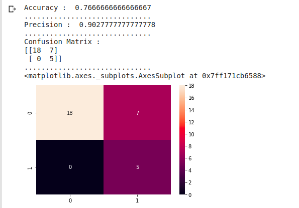
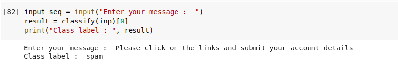

# Spam Ham classification using Hidden Markov Model

In this Project we are classifying messages into two classes Ham or Spam using Hidden Markov Model which is a statistical model in which the model is assumed to be a Markov
process with unobserved (i.e. hidden) states . Hidden Markov models are especially known for their application in reinforcement learning and temporal pattern recognition such as speech, handwriting, gesture recognition, part-of-speech tagging, musical score following, partial discharges and bioinformatics. 

## Dependencies

* Python 3
* nltk
* scikit-learn
* numpy
* pandas
* re 
* seaborn

## For Running this project

* Data file named "spamdata_hmm.csv" should be loaded with the given code in google colab.
* Run the ipynb file.
* Accuracy , Precision and Confusion matrix is shown.
* Console is asking for the user input. In this , type the message for which you want to predict whether the message is Spam or Ham.
* Result is shown as an output for that message.

## Output

